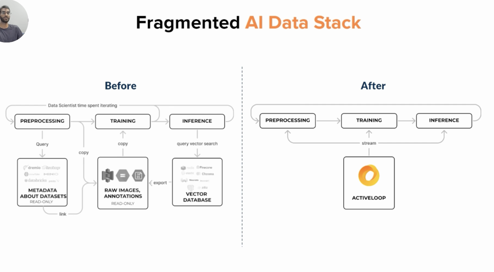

# [Course website][first_sec]

This course is by activeloop, initiative collaborated by Activeloop, Towards AI, and Intel Disruptor. It's about LLM and langchain! INteresting stuff, super cool stuff actually!

## Example aplications of LLM

1. [Github code understanding!][llm_ex_1]
2. [Analyzing financial statement][llm_ex_2]

A critical aspect of this course centers on understanding the current limitations of LLMs, specifically hallucinations and limited memory. However, solutions to these limitations exist, and one of the most potent is the use of Vector Stores. Throughout this course, we will delve into the usage of Activeloop’s Deep Lake vector store as an effective remedy.

## Overview of the module

1. From zero to hero
2. LLM & Langchain
3. Learning how to prompt
4. Keeping knowledge organized with indexes
5. Combining components together with chains
6. Giving memory to LLMs.
7. Making LLMs Interact with the World Using Tools
8. Using Language Model as Reasoning Engines with Agents

OpenAI API cost should be around $3.
If cost is a concern, go to the lesson called “Using the Open-Source GPT4All Model Locally”, to run a local LLm.

### Dependency

langchain (0.0.208)
deeplake (3.6.5)
openai (0.27.8)
tiktoken (0.4.0)

### The issue of hallucination and how it can be mitigated.

However, the LLM's knowledge is restricted to its training set. So, suppose the model was trained on data up to 2021 and is asked about a company founded in 2023. In that case, it may generate a plausible but entirely fabricated description - a phenomenon known as "**hallucination**.” Managing hallucinations is tricky, especially in applications where accuracy and reliability are paramount, such as customer-service chatbots, knowledge-base assistants, or AI tutors.

One promising strategy to mitigate hallucination is the use of retrievers in tandem with LLMs. A retriever fetches relevant information from a trusted knowledge base (like a search engine), and the LLM is then specifically prompted to rearrange the information without inventing additional details.

This is where they introduce deeplake, to solve this issue.

#### LLM-based applications architectural layer:

Deeplake platform, looks pretty promising:

[first_sec]: https://learn.activeloop.ai/courses/take/langchain/texts/46192457-course-introduction-things-you-should-know-before-you-star
[llm_ex_1]: https://www.activeloop.ai/resources/lang-chain-gpt-4-for-code-understanding-twitter-algorithm/
[llm_ex_2]: https://www.activeloop.ai/resources/ultimate-guide-to-lang-chain-deep-lake-build-chat-gpt-to-answer-questions-on-your-financial-data/
